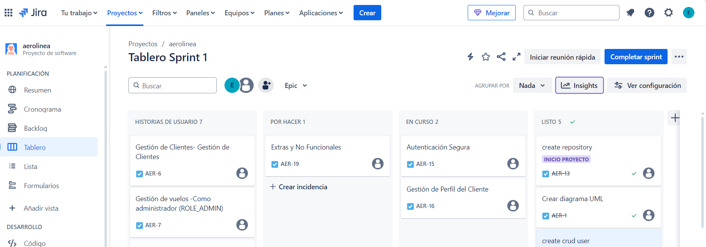

# ✈️ **Proyecto Sistema de Gestión de Vuelos API REST**


## 📖 Índice
1. [Descripción del Proyecto](#descripción-del-proyecto)
2. [Características Principales](#características-principales)
3. [Estructura del Proyecto](#estructura-del-proyecto)
4. [Instalación y Configuración](#instalación-y-configuración)
5. [Endpoints de la API](#endpoints-de-la-api)
6. [Gestión de Reservas](#gestión-de-reservas)
7. [Tecnologías Utilizadas](#tecnologías-utilizadas)
8. [Contribución](#contribución)
9. [Gestión del Proyecto](#gestión-del-proyecto)


## 💡 **Descripción del Proyecto**
Este proyecto es una API REST desarrollada en **Java Spring Boot** para gestionar vuelos, aeropuertos, clientes y reservas. Permite a los usuarios buscar vuelos, hacer reservas y a los administradores gestionar aeropuertos y trayectos.

## 🚀 **Características Principales**
- ✈️ **Gestión de Vuelos**
    - Carga automática de vuelos desde un archivo `.sql`.
    - Cambio de estado cuando un vuelo está lleno o ha pasado la fecha.

- 👤 **Gestión de Clientes**
    - Registro y autenticación con roles (`ROLE_ADMIN`, `ROLE_USER`).
    - Generación y validación de tokens JWT o cookies de sesión.

- 🎟 **Gestión de Reservas**
    - Verificación de disponibilidad y bloqueo de plazas por 15 minutos.
    - Solo usuarios autenticados pueden reservar vuelos.

## 📂 **Estructura del Proyecto**
```  
📦 vuelos-api
├── 📂 src│   
├── 📂 main│   
│├── 📂 java│  
       ├── 📂 com.example.vuelos│  
                ├── 📂 controllers│
                ├── 📂 services│
                ├── 📂 repositories│
                ├── 📂 models│ 
                ├── 📂 security│   
                ├── 📂 test│  
├── 📄 pom.xml
├── 📄 application.properties
```  

  
## 📦 **Endpoints de la API**  
  
| **Método** | **Endpoint**            | **Descripción** |  
|------------|-------------------------|-----------------|  
| **GET**    | `/api/flights`          | Obtener todos los vuelos disponibles. |  
| **POST**   | `/api/flights/search`   | Buscar vuelos según origen, destino y fecha. |  
| **POST**   | `/api/reservations`     | Reservar un vuelo. |  
| **GET**    | `/api/reservations/{id}` | Obtener detalles de una reserva. |  
| **DELETE** | `/api/reservations/{id}` | Cancelar una reserva. |  
  
  
### ✍️ **Ejemplo de solicitud para reservar un vuelo:**  

```
json!    POST /api/reservations    {        "userId": 1,        "flightId": 10,        "passengers": 2    }  
```  
## 🛠️ **Tecnologías Utilizadas**  
- ☕ **Java Spring Boot**: Framework principal para la API.  
- 🗄️ **PostgreSQL**: Base de datos utilizada.  
- 🔐 **JWT**: Para la autenticación segura de usuarios.  
- 📡 **Postman**: Para probar los endpoints.  
- 🛠 **Maven**: Para la gestión de dependencias. 
 
  
## 📝 **Ejecutar el Proyecto**  
1. Clonar el repositorio:  
    ```bash  
    git clone https://github.com/TuUsuario/VuelosAPI.git  
    ``` 
  Configurar variables de entorno en `application.properties`.  

2. Construir el proyecto con Maven:  
    ```bash  
    mvn clean install  
    ```4. Ejecutar la API:  
    ```bash  
    mvn spring-boot:run  
    ```  
## 🧪 **Ejecutar Tests**  
Para ejecutar los tests, usa:  
```bash  
mvn test 
```  
  
## 📢 **Contribución**  
Las contribuciones son bienvenidas. Para colaborar, por favor abre un issue o un pull request en el repositorio.  
  
## 📌 **Gestión del Proyecto**  
El proyecto se gestiona con **JIRA**. Puedes ver el tablero en el siguiente enlace:  
🔗 [Tablero en JIRA](https://tuinstancia.atlassian.net/browse/VUELOSAPI)  
  
## 📌 **Diagramas**  
El proyecto se gestiona con **Diagramas**. Puedes ver el tablero en el siguiente enlace:  
🔗 [Diagrama UML](https://miro.com/app/board/uXjVLuw2pSU=/)  
  
  
  
🔗 [Tablero en JIRA](https://tuinstancia.atlassian.net/browse/VUELOSAPI)  
